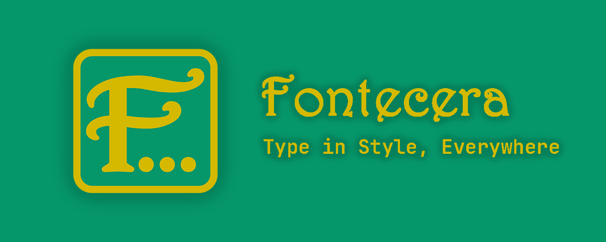
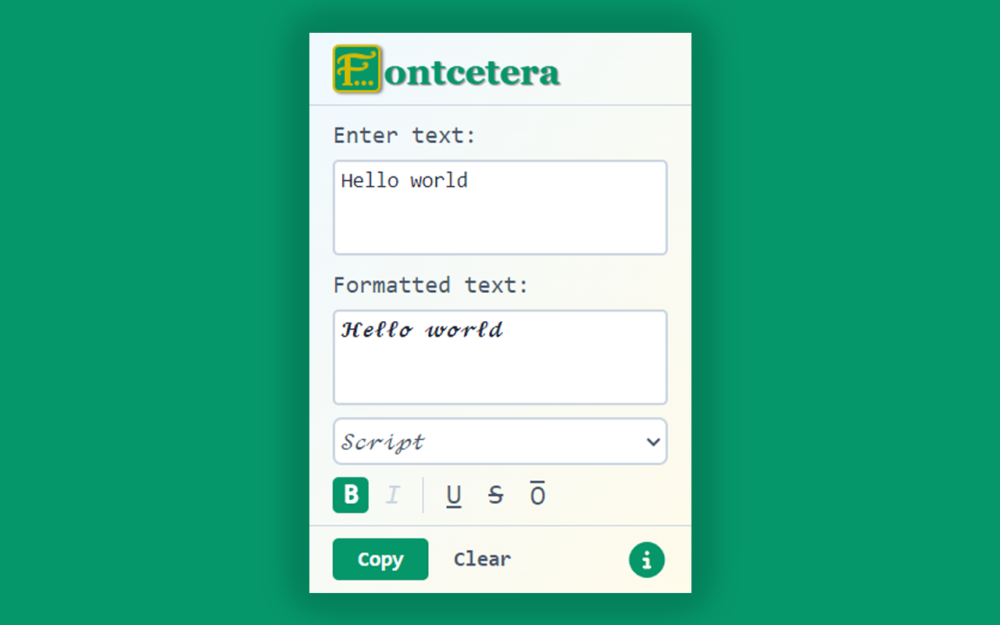

# Fontcetera - Uniform Text Formatter

Fontcetera is a Chrome extension that allows you to easily format your text with various Unicode fonts and styles.

## Features

- Multiple font styles including Serif, Sans-serif, Gothic, Script, Double-struck, Monospace, and Full width.
- Text decorations: Bold, Italic, Underline, Strikethrough, and Overline (availability depends on the selected font).
- Real-time text formatting preview.
- Easy copy-to-clipboard functionality.
- Simple and intuitive user interface.



## Usage

1. Enter your text in the input field.
2. Select the desired font from the dropdown menu.
3. Apply text decorations using the buttons (B, I, U, S, O).
4. The formatted text will be displayed in the output field.
5. Click "Copy" to copy the formatted text to your clipboard.

## Font Options

- Serif (default)
- Sans-serif
- Gothic
- Script
- Double-struck
- Monospace
- Full width

Note: Not all decorations are available for every font. The UI will disable options that are not applicable to the selected font.

## Development

### Prerequisites

- Node.js
- npm or yarn

### Installation

1. Clone the repository:

   ```bash
   git clone https://github.com/your-username/fontcetera.git
   cd fontcetera
   ```

2. Install dependencies:

   ```bash
   npm install
   # or
   yarn install
   ```

3. Start the development server:
   ```bash
   npm run dev
   # or
   yarn dev
   ```
4. Open Chrome and navigate to `chrome://extensions/`.
5. Enable "Developer mode" by toggling the switch in the top right corner.
6. Click "Load unpacked" and select the `dist` directory.

### Build

To create a production build, run:

```bash
npm run build
# or
yarn build
```

## Contributing

Contributions are welcome! Please feel free to submit a Pull Request.

## License

This project is licensed under the MIT License.

## Author

Created by [Youssef Rbahi](https://rbahi.com)

## Acknowledgements

This project uses the following libraries and resources:

- [React](https://reactjs.org/): A JavaScript library for building user interfaces
- [Vite](https://vitejs.dev/): Next Generation Frontend Tooling
- [string-to-unicode-variant](https://github.com/Mottie/string-to-unicode-variant): A library to convert strings to unicode variants
- [Tailwind CSS](https://tailwindcss.com/): A utility-first CSS framework
- [SVGR](https://react-svgr.com/): Transform SVGs into React components
- [Font Awesome](https://fontawesome.com/): For the house and info circle icons
- [TypeScript](https://www.typescriptlang.org/): A typed superset of JavaScript
- [ESLint](https://eslint.org/): A tool for identifying and reporting on patterns in JavaScript
- [Prettier](https://prettier.io/): An opinionated code formatter

Feel free to reach out if you have any questions or suggestions!
